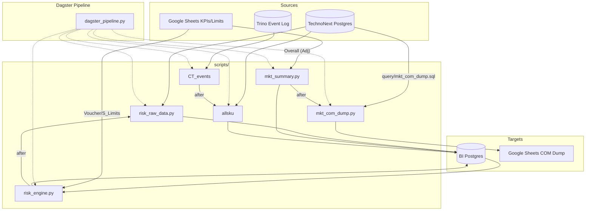

# Project Context: Python_scripts (Data Platform)

This document provides a high-fidelity overview of the `Python_scripts` project, designed to help LLMs and developers understand the architecture, data flows, and development patterns of the system.

## Project Overview
The `Python_scripts` codebase is a data orchestration and ETL platform. It manages the extraction of data from multiple sources (PostgreSQL, Trino, Google Sheets), performs transformations, and loads results into a target PostgreSQL BI database or back into Google Sheets.

The system has transitioned from a watchdog-based execution model to a native **Dagster** orchestration setup for improved observability, scheduling, and error handling.

## Architecture Diagram (Mermaid)

## Component Directory

### Core Orchestration
- **[dagster_pipeline.py](file:///c:/Python_scripts/dagster_pipeline.py)**: The central hub for defining Ops, Jobs, and Schedules. It uses `subprocess` to execute legacy Python scripts and contains native Dagster Assets (like `CT_events` and `allsku`).
- **[workspace.yaml](file:///c:/Python_scripts/workspace.yaml)**: Configures the Dagster code location.

### Implementation Scripts (`scripts/`)
- **Risk Domain**:
    - `risk_raw_data.py`: High-volume ETL building the `daily_order_report`.
    - `risk_engine.py`: Complex fraud/abuse detection logic.
- **Marketing Domain**:
    - `mkt_com_dump.py`: Exports commerce data to Google Sheets via SQL.
    - `mkt_summary.py`: Imports transformed marketing KPIs from Google Sheets to BI DB.
- **Catalog/Events**:
    - `allsku.py`: Synchronizes product catalog metadata.
    - `CT_events.py`: Incremental user event ETL from Trino.

### Utilities (`utils/`)
- **[db_handler.py](file:///c:/Python_scripts/utils/db_handler.py)**: Centralized database interaction. Uses SQLAlchemy. Implements logic for:
    - Multiple engine creation (`DB_1`, `DB_2`, `Trino`).
    - Safe table truncation (TRUNCATE with DELETE fallback).
    - SSL/Keepalive configuration for connection stability.
- **[log_file.py](file:///c:/Python_scripts/utils/log_file.py)**: Standardized `LogManager` for consistent logging across all scripts.

### Secondary Assets
- **`query/`**: Contains raw `.sql` files to keep Python logic clean and SQL queries version-controlled.
- **`service_account.json`**: Credentials for Google Sheets API access.
- **`.env`**: Stores database credentials and environment-specific configs.

## Development Patterns

### Database Interactions
- **Pattern**: Always use `utils.db_handler.create_sqlalchemy_engine_x()` rather than hardcoding credentials or connections.
- **Pattern**: Prefer `truncate_table_safe()` when clearing tables to handle potential lock issues or transaction conflicts gracefully.
- **Pattern**: Use `pd.to_sql` with `method='multi'` and `chunksize` for high-performance loads.

### Logging
- **Standard**: Every script must initialize a `LogManager` from `utils.log_file`.
- **Standard**: Dagster Ops stream script output to the Dagster event log for centralized monitoring.

### Error Handling
- Scripts should raise `RuntimeError` or descriptive exceptions to signal failure to the Dagster orchestrator, which handles retries and alerts.

## LLM Guidance
- **Database Access**: If asked to modify a script, ensure it uses `utils.db_handler` for all DB operations. Do not introduce new DB connection logic.
- **Paths**: The project uses absolute paths defined in `dagster_pipeline.py` or relative paths assuming the root directory.
- **SQL Modifications**: Check `query/*.sql` before modifying SQL strings inside Python files.
- **Dagster Integration**: When adding new scripts, they must be wrapped in an `@op` and included in a `@job` within `dagster_pipeline.py`.
